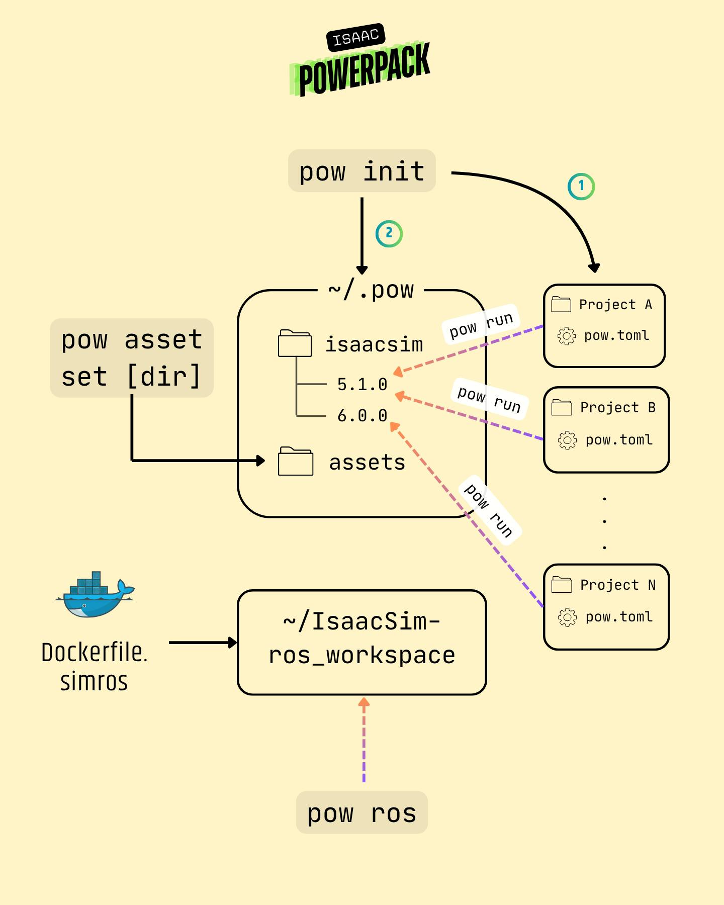

# CLI Reference

## `pow init`

Initialize an Isaac Sim project. All projects are isolated from each other. Only file and isaacsim app in global `~/.pow` are shared between projects.



This interactive command walks through a 10-step setup:

1. Validates the project directory (requires `pyproject.toml`)
2. Checks for existing `pow.toml` configuration
3. Creates the `.pow` global folder if it's not exists
4. Downloads and installs your specified Isaac Sim version in `.pow/isaacsim/<version>` folder
5. Applies post-install optimizations
6. Sets up ROS integration (optional — builds Docker images)
7. Creates project structure (`exts/`, `scripts/`, `.modules/`, `.assets/`, `standalone/`, `usda/`)
8. Symlinks the managed Isaac Sim installation into the project for intellisense/code completion
9. Configures VS Code settings
10. Generates `pow.toml` configuration

```bash
pow init
```

---

## `pow run`

Run Isaac Sim with the configured profile and extensions from `pow.toml`. See more detail for `pow.toml` configuration in [Configuration Guide](docs/configuration.md).

```bash
# Run with default profile
pow run

# Run with a named profile
pow run -p perf

# Open a specific USD file
pow run -o /path/to/scene.usd

# Pass extra arguments directly to Isaac Sim
pow run -- --/renderer/enabled=gpu
```

| Option              | Description                                        |
| :------------------ | :------------------------------------------------- |
| `-p`, `--profile`   | Profile name from `pow.toml` (default: `default`)  |
| `-o`, `--open`      | Path to a USD file to open on launch               |

> [!WARNING]
> `-o` or `--open` is still in experiment. We have found bug that cause **missing assets** issue when opening scenes using this flag. Suggestion to avoid this problem is by opening the scene via GUI or load scene with `isaacsim api` in your custom extension.

---

## `pow python`

Run Isaac Sim's bundled Python interpreter (`.pow/isaacsim/<version>/python.sh`)for running standalone isaac sim application.

```bash
# Run a standalone script
pow python my_script.py

# Run inline Python
pow python -c "import omni; print(omni.__version__)"

# Use a specific profile
pow python -p perf my_script.py
```

| Option              | Description                                        |
| :------------------ | :------------------------------------------------- |
| `-p`, `--profile`   | Profile name from `pow.toml` (default: `default`)  |

---

## `pow ros`

Launch the `pow_simros` Docker container for ROS development. Requires ROS integration to be enabled during `pow init`. See more about ROS 2 enable flag in [Configuration Guide](docs/configuration.md).

```bash
# Start an interactive ROS bash session
pow ros

# Show detailed container launch feedback
pow ros -v

# Pass a custom command to the container
pow ros -- ros2 topic list
```

| Option              | Description                              |
| :------------------ | :--------------------------------------- |
| `-v`, `--verbose`   | Show detailed feedback during launch     |

---

## `pow check`

Run the Isaac Sim compatibility check to verify your system meets requirements.

```bash
pow check
```

---

## `pow asset`

Group of commands to manage Isaac Sim local assets.

### `pow asset set <PATH>`

Set the local asset path. Creates a symlink, registers aliases in `omniverse.toml`, and patches Isaac Sim configs.

```bash
# Set asset path with all alias support (default)
pow asset set /path/to/assets

# Set with specific alias support
pow asset set /path/to/assets -a isaacsim
pow asset set /path/to/assets -a simready

# Set without any alias patching
pow asset set /path/to/assets -a none
```

| Option                    | Description                                                |
| :------------------------ | :--------------------------------------------------------- |
| `-a`, `--alias-support`   | Alias target: `isaacsim`, `simready`, or `none` (repeatable) |


> [!NOTE]
> Currently, we only support `isaacsim` assets and `none` alias. We will add `simready` assets download support and others in the future.

### `pow asset unset`

Remove the local asset configuration — clears symlink, config, and alias patches.

```bash
pow asset unset
```

### `pow asset info`

Show the current local asset configuration status.

```bash
pow asset info
```

### `pow asset list`

List all supported assets in the registry.

```bash
pow asset list
```

### `pow asset add <TARGET>`

Install assets by group or name.

```bash
# Install by group (default)
pow asset add local-assets

# Install by name
pow asset add -n nova_carter_sensors

# Keep downloaded files or use assets to install from this path
pow asset add local-assets -k /path/to/keep
```

| Option          | Description                                      |
| :-------------- | :----------------------------------------------- |
| `-n`, `--name`  | Install asset by name                            |
| `-g`, `--group` | Install asset by group (default behavior)          |
| `-k`, `--keep`  | Keep downloaded files or use assets to install from this path |

---

## `pow lint`

Check `.usda` files for asset path compatibility issues. Defaults to `dry-run` when no subcommand is given.

### `pow lint [dry-run] [PATH]`

Report lint issues without modifying files.

```bash
# Lint current directory
pow lint

# Lint a specific path
pow lint ./usda

# Short output (file + line only)
pow lint -s
```

### `pow lint fix [PATH]`

Automatically fix lint issues in `.usda` files.

```bash
pow lint fix
pow lint fix ./usda
pow lint fix -s
```

| Option          | Description                          |
| :-------------- | :----------------------------------- |
| `-s`, `--short` | Show only file path and line number  |

For a detailed explanation of each rule, patterns, and before/after examples, see the [Lint Rules Guide](lint-rules.md).
